# MotorTrace Mobile App - Technician Use Case Diagram

## Overview
This document contains the use case diagram for the MotorTrace Mobile App, focusing on the Technician actor and their interactions with the system. The diagram is based on analysis of the Technician folder screens in the MotorTraceMobile application.

## Actors
- **Technician**: The primary actor who uses the mobile app to manage work orders, perform vehicle inspections, and complete service tasks

## Use Case Diagram

```mermaid
graph TD
    A[Technician] --> B[Dashboard]
    A --> C[Work Order Management]
    A --> D[Inspection & Service]
    A --> E[Inventory Management]
    A --> F[Profile Management]
    A --> G[Search & History]

    B --> B1[View Dashboard Stats]
    B --> B2[View Today's Work Orders]
    B --> B3[View Work Queue]

    C --> C1[View Assigned Work Orders]
    C --> C2[Update Work Order Status]
    C --> C3[View Work Order Details]
    C --> C4[Manage Work Progress]
    C --> C5[Complete Work Orders]

    D --> D1[Perform Vehicle Inspection]
    D --> D2[Request Parts]
    D --> D3[Execute Service Work]
    D --> D4[Upload Proof Images]
    D --> D5[Add Completion Notes]
    D --> D6[Conduct Final Inspection]
    D --> D7[Perform Test Drive]

    E --> E1[Search Parts Inventory]
    E --> E2[Check Part Availability]
    E --> E3[Request Parts]
    E --> E4[View Part Details]

    F --> F1[View Profile]
    F --> F2[Update Profile]
    F --> F3[Manage Settings]
    F --> F4[View Certifications]

    G --> G1[Search Work Orders]
    G --> G2[View Work History]
    G --> G3[Filter Search Results]

    C4 --> C41[Start Work]
    C4 --> C42[Update Progress]
    C4 --> C43[Pause Work]

    D1 --> D11[Review Customer Problems]
    D1 --> D12[Document Findings]
    D1 --> D13[Create Service Plan]

    D2 --> D21[Select Required Parts]
    D2 --> D22[Submit Parts Request]

    D5 --> D51[Notify Customer]
    D5 --> D52[Generate Receipt]
```

## Use Case Groups

### 1. Dashboard Management
**Primary Actor**: Technician

**Use Cases**:
- **View Dashboard Stats**: Technician can view statistics about pending, in-progress, completed, and urgent work orders
- **View Today's Work Orders**: Technician can see all assigned work orders for the current day
- **View Work Queue**: Technician can browse the queue of pending work orders with priority information

### 2. Work Order Management
**Primary Actor**: Technician

**Use Cases**:
- **View Assigned Work Orders**: Technician can access all work orders assigned to them
- **Update Work Order Status**: Technician can change the status of work orders (pending, in-progress, completed)
- **View Work Order Details**: Technician can see comprehensive information about a specific work order
- **Manage Work Progress**: Technician can track and update the progress of ongoing work
- **Complete Work Orders**: Technician can mark work orders as completed with final documentation

**Sub-Use Cases for Work Progress Management**:
- **Start Work**: Technician can begin working on an assigned work order
- **Update Progress**: Technician can update the current phase of work
- **Pause Work**: Technician can temporarily pause work on an order

### 3. Inspection & Service Execution
**Primary Actor**: Technician

**Use Cases**:
- **Perform Vehicle Inspection**: Technician can conduct thorough vehicle inspections
- **Request Parts**: Technician can request necessary parts for repairs
- **Execute Service Work**: Technician can perform the actual service and repair work
- **Upload Proof Images**: Technician can upload photos documenting work performed
- **Add Completion Notes**: Technician can add detailed notes about work completed
- **Conduct Final Inspection**: Technician can perform final quality checks
- **Perform Test Drive**: Technician can test drive vehicles after service completion

**Sub-Use Cases for Vehicle Inspection**:
- **Review Customer Problems**: Technician can examine reported issues
- **Document Findings**: Technician can record inspection results
- **Create Service Plan**: Technician can develop repair recommendations

**Sub-Use Cases for Parts Management**:
- **Select Required Parts**: Technician can choose parts needed for repairs
- **Submit Parts Request**: Technician can submit parts requests for approval

**Sub-Use Cases for Work Completion**:
- **Notify Customer**: Technician can send completion notifications
- **Generate Receipt**: Technician can create service receipts

### 4. Inventory Management
**Primary Actor**: Technician

**Use Cases**:
- **Search Parts Inventory**: Technician can search for available parts
- **Check Part Availability**: Technician can verify stock levels and locations
- **Request Parts**: Technician can request parts that are out of stock
- **View Part Details**: Technician can see comprehensive part information

### 5. Profile Management
**Primary Actor**: Technician

**Use Cases**:
- **View Profile**: Technician can see their personal and professional information
- **Update Profile**: Technician can modify their profile information
- **Manage Settings**: Technician can configure app preferences and work settings
- **View Certifications**: Technician can review their professional certifications

### 6. Search & History
**Primary Actor**: Technician

**Use Cases**:
- **Search Work Orders**: Technician can search through work order history
- **View Work History**: Technician can review completed work orders and performance
- **Filter Search Results**: Technician can filter results by status, date, service type, etc.

## Detailed Use Case Descriptions

### UC-1: View Dashboard Stats
**Actor**: Technician
**Preconditions**: Technician is logged in
**Main Flow**:
1. Technician opens the app
2. System displays dashboard with work order statistics
3. Technician views counts of pending, in-progress, completed, and urgent work orders
**Postconditions**: Dashboard statistics are displayed

### UC-2: Manage Work Orders
**Actor**: Technician
**Preconditions**: Technician is logged in and has assigned work orders
**Main Flow**:
1. Technician navigates to work orders section
2. System displays list of assigned work orders
3. Technician can view details, update status, and track progress
4. Technician can start, pause, or complete work orders
**Postconditions**: Work order status is updated

### UC-3: Perform Vehicle Inspection
**Actor**: Technician
**Preconditions**: Technician has an assigned work order requiring inspection
**Main Flow**:
1. Technician selects inspection from work order actions
2. System displays inspection checklist
3. Technician reviews customer-reported problems
4. Technician performs physical inspection
5. Technician documents findings and creates service recommendations
**Postconditions**: Inspection results are recorded

### UC-4: Execute Service Work
**Actor**: Technician
**Preconditions**: Work order is approved and parts are available
**Main Flow**:
1. Technician begins work execution phase
2. System guides through service steps
3. Technician performs repairs and maintenance
4. Technician uploads proof images
5. Technician adds completion notes
**Postconditions**: Service work is completed

### UC-5: Manage Parts Inventory
**Actor**: Technician
**Preconditions**: Technician needs parts for service work
**Main Flow**:
1. Technician searches parts inventory
2. System displays available parts with stock levels
3. Technician checks part compatibility and pricing
4. Technician requests parts if needed
**Postconditions**: Parts availability is confirmed

### UC-6: Complete Work Order
**Actor**: Technician
**Preconditions**: All service work is finished
**Main Flow**:
1. Technician marks work as completed
2. System prompts for final documentation
3. Technician adds completion notes and proof images
4. Technician notifies customer of completion
5. System generates service receipt
**Postconditions**: Work order is marked complete and customer is notified

## System Boundaries
The MotorTrace Mobile App system boundary for technicians includes:
- Work order assignment and management
- Vehicle inspection workflows
- Parts inventory access
- Service execution tracking
- Customer communication
- Performance analytics

External systems include:
- Backend API for work order data
- Parts inventory system
- Customer notification services
- Payment processing systems
- Quality assurance systems

## Assumptions
- Technician has proper certifications and training
- Mobile device has camera for photo documentation
- Network connectivity is available for real-time updates
- Backend systems are operational
- Parts inventory is up-to-date

## Future Enhancements
- Integration with diagnostic tools
- Augmented reality for repair guidance
- Real-time collaboration with other technicians
- Advanced analytics and performance tracking
- Integration with manufacturer service databases
- Automated work order routing based on technician expertise