# MotorTrace Mobile App - User Use Case Diagram

## Overview
This document contains the use case diagram for the MotorTrace Mobile App, focusing on the User actor and their interactions with the system. The diagram is based on comprehensive analysis of all User folder screens in the MotorTraceMobile application.

## Actors
- **User**: The primary actor who uses the mobile app to manage their vehicles and service appointments

## Use Case Diagram

```mermaid
graph TD
    A[User] --> B[Dashboard]
    A --> C[Vehicle Management]
    A --> D[Service Management]
    A --> E[Profile Management]
    A --> F[Communication]
    A --> G[Support]
    A --> H[Product Management]

    B --> B1[View Dashboard Stats]
    B --> B2[View Quick Actions]
    B --> B3[View Recent Services]
    B --> B4[View Upcoming Services]

    C --> C1[View All Cars]
    C --> C2[Add New Car]
    C --> C3[View Car Details]
    C --> C4[Edit Car Details]
    C --> C5[Track Car Issues]
    C --> C6[View Car Products]
    C --> C7[Edit Car Status]

    D --> D1[Book Service]
    D --> D2[View Service History]
    D --> D3[Track Service Progress]
    D --> D4[View Service Reservations]
    D --> D5[Manage Appointments]
    D --> D6[View Service Bills]
    D --> D7[View Inspection Results]
    D --> D8[Approve Service Estimates]
    D --> D9[Select Parts]
    D --> D10[View Detailed Bills]

    E --> E1[View Profile]
    E --> E2[Edit Profile]
    E --> E3[Delete Account]
    E --> E4[Change Profile Picture]

    F --> F1[Chat with Support]
    F --> F2[View FAQ]

    G --> G1[View Support Chat]
    G --> G2[Rate Services]

    H --> H1[View Used Parts & Products]
    H --> H2[Track Product Warranties]
    H --> H3[Monitor Product Conditions]

    D5 --> D51[Reschedule Appointment]
    D5 --> D52[Cancel Appointment]
    D5 --> D53[View Appointment Details]

    D3 --> D31[View Inspection Results]
    D3 --> D32[Approve Service Estimates]
    D3 --> D33[Select Parts]
    D3 --> D34[Track Service Flow]

    C6 --> C61[View Product Details]
    C6 --> C62[Track Warranty Status]
    C6 --> C63[Monitor Product Health]
```

## Use Case Groups

### 1. Dashboard Management
**Primary Actor**: User

**Use Cases**:
- **View Dashboard Stats**: User can view statistics about their vehicles, active services, and scheduled appointments
- **View Quick Actions**: User can access quick action buttons for common tasks like booking services and managing vehicles
- **View Recent Services**: User can see their most recent service activities
- **View Upcoming Services**: User can see scheduled maintenance and service reminders

### 2. Vehicle Management
**Primary Actor**: User

**Use Cases**:
- **View All Cars**: User can browse their registered vehicles with details like mileage, status, and last service
- **Add New Car**: User can register a new vehicle in the system
- **View Car Details**: User can view detailed information about a specific vehicle
- **Edit Car Details**: User can update vehicle information and specifications
- **Track Car Issues**: User can monitor and manage issues reported for their vehicles
- **View Car Products**: User can see parts and products used in their vehicles
- **Edit Car Status**: User can update the operational status of their vehicles

**Sub-Use Cases for Product Management**:
- **View Product Details**: User can see detailed information about installed parts
- **Track Warranty Status**: User can monitor warranty periods for parts
- **Monitor Product Health**: User can track the condition and performance of installed parts

### 3. Service Management
**Primary Actor**: User

**Use Cases**:
- **Book Service**: User can schedule new service appointments
- **View Service History**: User can review past service records and ratings
- **Track Service Progress**: User can monitor ongoing service work in real-time
- **View Service Reservations**: User can see upcoming and ongoing appointments
- **Manage Appointments**: User can handle appointment-related actions
- **View Service Bills**: User can review completed service invoices and payments
- **View Inspection Results**: User can review vehicle inspection findings
- **Approve Service Estimates**: User can approve or reject service cost estimates
- **Select Parts**: User can choose replacement parts for repairs
- **View Detailed Bills**: User can see comprehensive billing information with itemized services

**Sub-Use Cases for Appointment Management**:
- **Reschedule Appointment**: User can change the date/time of existing appointments
- **Cancel Appointment**: User can cancel scheduled appointments
- **View Appointment Details**: User can see comprehensive appointment information

**Sub-Use Cases for Service Tracking**:
- **View Inspection Results**: User can review vehicle inspection findings
- **Approve Service Estimates**: User can approve or reject service cost estimates
- **Select Parts**: User can choose replacement parts for repairs
- **Track Service Flow**: User can follow the service workflow progress

### 4. Profile Management
**Primary Actor**: User

**Use Cases**:
- **View Profile**: User can see their account information and preferences
- **Edit Profile**: User can update their personal information
- **Delete Account**: User can permanently remove their account from the system
- **Change Profile Picture**: User can upload or change their profile image

### 5. Communication
**Primary Actor**: User

**Use Cases**:
- **Chat with Support**: User can communicate with customer support via chat
- **View FAQ**: User can access frequently asked questions and help documentation

### 6. Support Services
**Primary Actor**: User

**Use Cases**:
- **View Support Chat**: User can access support conversation history
- **Rate Services**: User can provide feedback and ratings for completed services

### 7. Product Management
**Primary Actor**: User

**Use Cases**:
- **View Used Parts & Products**: User can see all parts and products installed in their vehicles
- **Track Product Warranties**: User can monitor warranty status and expiration dates
- **Monitor Product Conditions**: User can track the health and performance of installed products

## Detailed Use Case Descriptions

### UC-1: View Dashboard Stats
**Actor**: User
**Preconditions**: User is logged in
**Main Flow**:
1. User opens the app
2. System displays dashboard with statistics
3. User views vehicle count, active services, and scheduled appointments
**Postconditions**: Dashboard statistics are displayed

### UC-2: Book Service
**Actor**: User
**Preconditions**: User is logged in and has registered vehicles
**Main Flow**:
1. User selects "Book Service" from dashboard or menu
2. System displays available services
3. User selects service type and vehicle
4. User chooses date and time
5. System confirms booking
**Postconditions**: Service appointment is scheduled

### UC-3: Track Service Progress
**Actor**: User
**Preconditions**: User has an ongoing service appointment
**Main Flow**:
1. User navigates to reservations screen
2. System shows current service status
3. User can view progress, assigned technician, and estimated completion
4. User can interact with service workflow (approve estimates, select parts)
**Postconditions**: User is informed about service progress

### UC-4: Manage Vehicles
**Actor**: User
**Preconditions**: User is logged in
**Main Flow**:
1. User navigates to Cars screen
2. System displays list of registered vehicles
3. User can add new vehicles, edit existing ones, or view details
4. User can track issues and maintenance for each vehicle
**Postconditions**: Vehicle information is updated

### UC-5: View Service History
**Actor**: User
**Preconditions**: User has completed services
**Main Flow**:
1. User navigates to Service History screen
2. System displays past services with ratings and costs
3. User can filter by date, service type, or garage
4. User can rate completed services
**Postconditions**: Service history is displayed

### UC-6: Communicate with Support
**Actor**: User
**Preconditions**: User is logged in
**Main Flow**:
1. User accesses chat or FAQ from menu
2. System provides communication interface
3. User can send messages or browse help content
**Postconditions**: User receives support assistance

### UC-7: View Used Parts & Products
**Actor**: User
**Preconditions**: User has vehicles with service history
**Main Flow**:
1. User selects a vehicle
2. System displays parts and products used
3. User can view warranty status, conditions, and installation dates
4. User can track product health and maintenance needs
**Postconditions**: Product information is displayed

### UC-8: View Detailed Bills
**Actor**: User
**Preconditions**: User has completed services
**Main Flow**:
1. User selects a completed service
2. System displays detailed bill with itemized services and parts
3. User can view taxes, discounts, and payment information
4. User can download or print the receipt
**Postconditions**: Detailed billing information is shown

### UC-9: Edit Profile
**Actor**: User
**Preconditions**: User is logged in
**Main Flow**:
1. User navigates to profile settings
2. System displays current profile information
3. User can update name, contact information, and profile picture
4. User can verify contact information
5. System saves changes
**Postconditions**: Profile information is updated

## System Boundaries
The MotorTrace Mobile App system boundary includes:
- User authentication and profile management
- Vehicle registration and tracking
- Service appointment scheduling and management
- Real-time service progress tracking
- Parts and product inventory tracking
- Communication with support
- Integration with backend services for data persistence

External systems include:
- Backend API for data storage and business logic
- Payment processing systems
- Notification services
- Chat/messaging services
- Image upload/storage services

## Assumptions
- User has a smartphone with internet connectivity
- Backend services are available and responsive
- User has valid account credentials
- Vehicles are properly registered in the system

## Future Enhancements
- Integration with vehicle telematics for automatic mileage tracking
- AI-powered service recommendations
- Emergency roadside assistance booking
- Integration with insurance providers
- Social features for sharing vehicle experiences
- Advanced analytics for vehicle health monitoring
- Integration with parts suppliers for direct ordering